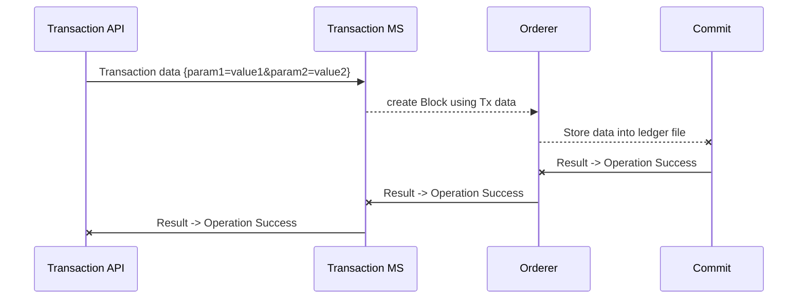

# Microservice Template

This is simple example of configuring Seneca js microservices with express api and build integrated microservices communication network using Mesh (gossip protocol).

# Microservices

There are three microservice :
**Transaction Microservice** : It create the transaction based on user provided data (using /transaction api)and send updated information to Orderer Microservices

**Orderer Microservices** : It create a batch or block and add its signature and send to commit Microservice.

**Commit Microservice** : It store the data into a file and send back response to Ordering Microserice and which in turn notify Transaction Microservice.

**Base Microservice:** It bootstrap the mesh network.

## Interesting Thing to know

Mesh create a decentralise network of microservices which has capabilty to do auto discover without any help of central registry.

## Pre requisite
This code has been tested with Ubuntu OS and node js version 8.x. Running this code on windows require installation of npm windows-build-tools package, python 2.7 and c++ build tool.

## Bootstrapping Application

cd /msTemplate
npm install nodemon -g
npm i

## Starting Microservices in a order

cd /webserver/microservices

**Base Microservices :**
cd /BaseMS
npm i
npm run start
npm run monitor

**Transaction Microservices**:

cd /TransactionMS
npm i
npm run start

**Orderer Microservices** :
cd /OrdereMS
npm i
npm run start

**Commit Microservices :**
cd /CommitMS
npm i
npm run start

## Starting Server
Go into Root folder.
cd /msTemplate
npm run start

## Create Transaction

call API using curl :
curl -d "param1=value1&param2=value2" -X POST http://localhost:3000/api/v1/transaction

# Result

It create a ledger.json file inside /webserver/microservices/CommitMS, which is result of intercommunication of API to Transaction MS ( Microservices) -> Orderer MS ->Commit MS

## UML diagrams

sequence diagram:

